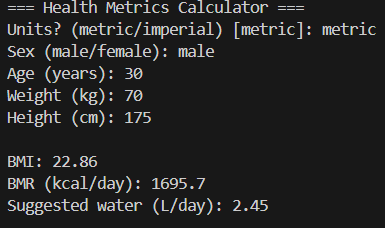
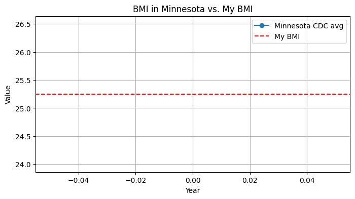

# Week 1 — Python Basics & Environment Setup

**Status:** ✅ Completed  
**Dates:** Aug 12–16, 2025

## 🎯 Goals
- Practice Python fundamentals (functions, I/O, conditionals)
- Build a **BMI / BMR / Hydration** CLI
- Log results to CSV and explore CDC BMI-related data in a notebook

## 🗂 What’s in this folder
- **`src/health_metrics.py`** — CLI app (metric/imperial) that saves runs to `data/week1_results.csv`
- **`notebooks/Week1_CDC_BMI_Analysis.ipynb`** — CDC BMI exploration + compare with my BMI
- **`data/week1_results.csv`** — small run log (kept in Git); big CDC CSV is *not* tracked

## ▶️ How to run
```bash
# from repo root
python Week-1/src/health_metrics.py
# then open the notebook and Run All 

## 🖼️ Screenshots
<p align="center">
  
  
</p>

## 🔗 Resources used
- FreeCodeCamp Python (YouTube)  
- W3Schools Python (reference)  
- Python for Everybody (Coursera – audit)

# Data for Week 1
- `week1_results.csv` — Log of BMI/BMR/Hydration results from CLI runs
- Large CDC CSV is excluded from repo (see `.gitignore`)